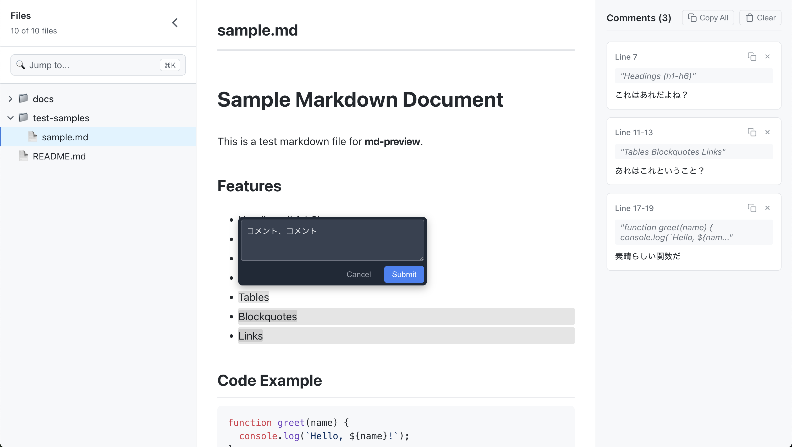

# md-review

[English](./README.md) | 日本語 | [简体中文](./README-zh.md)



Markdown ファイルにコメントを付けてレビューするための CLI ツール。
コメントはコピー可能で、AI エージェントへのフィードバックに使える。

## Features

- Markdown をそのままの形式で表示
- 特定の行にコメントを残せる
- 既存のコメントを編集可能
- ツリービューでファイルを選択
- ダークモード対応（システムの設定に追従）
- サイドバーのリサイズと折りたたみに対応
- コメントの行番号をクリックして該当箇所にジャンプ
- Markdown ファイル変更時の自動リロード

## Install

```shell
npm install -g md-review
```

## Usage

```sh
md-review [options]              # カレントディレクトリのすべてのマークダウンファイルをプレビュー
md-review <file> [options]       # 特定のマークダウンファイルをプレビュー
```

### Options

```sh
-p, --port <port>     # サーバーポート (default: 3030)
    --no-open         # ブラウザを自動で開かない
-h, --help            # ヘルプメッセージを表示
-v, --version         # バージョン番号を表示
```

### Examples

```sh
md-review                        # カレントディレクトリのすべてのマークダウンファイルをプレビュー
md-review README.md              # README.md をプレビュー
md-review docs/guide.md --port 8080
```

## コメント管理

### コメントの追加

1. Markdown プレビュー内でテキストを選択
2. 表示される "Comment" ボタンをクリック
3. コメントを入力して `Cmd/Ctrl+Enter` を押すか "Submit" をクリック

### コメントの編集

1. 既存のコメントの編集アイコン（鉛筆マーク）をクリック
2. テキストエリアで内容を修正
3. `Cmd/Ctrl+Enter` を押すか "Save" をクリックして保存
4. `Escape` を押すか "Cancel" をクリックして変更を破棄

### キーボードショートカット

- `Cmd/Ctrl+Enter` - コメントを送信/保存
- `Escape` - 編集をキャンセル
- `Cmd+K` - 検索バーにフォーカス（ディレクトリモード）

## 自動リロード

md-review は Markdown ファイルの変更を自動的に監視します:

- Markdown ファイルを編集・保存すると、プレビューが自動的に更新されます
- 手動でブラウザをリフレッシュする必要はありません
- 単一ファイルモードとディレクトリブラウズモードの両方で動作します
- ファイル監視には効率的な Server-Sent Events (SSE) を使用

これにより、ライブ編集のワークフローやドキュメントの素早い反復作業に最適です。

## License

[MIT](./LICENSE)
